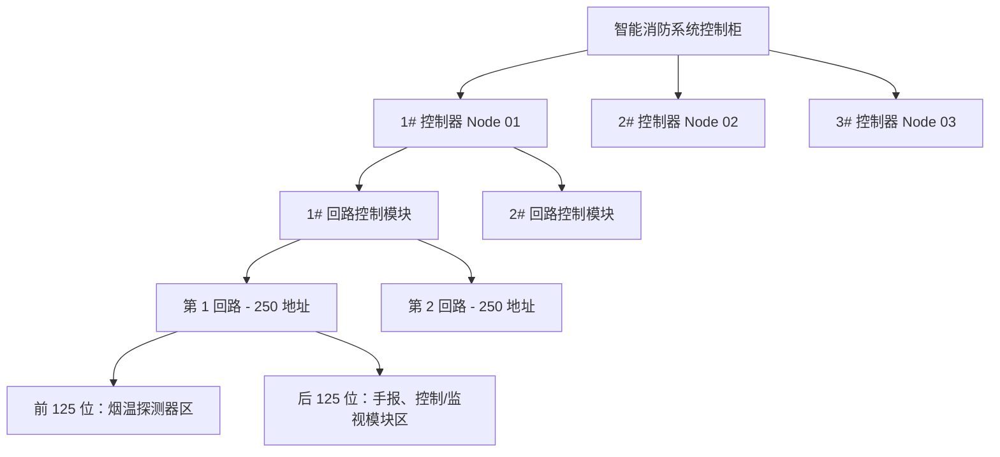

# 回路拓扑与网络拓扑图实现说明文档

我们已成功开发了“回路拓扑”与“火灾报警显示控制器网络图”功能，并且整个项目已顺利通过编译校验与生产构建。

---

## 变更文件摘要

- **[types.ts](file:///m:/TOPFIRE/TopFireAI/src/types.ts)**：扩充了 `PageKey` （增加了 `"topology"` 页面）以及 `TopologyDevice`、`FireLoop`、`LoopModule`、`ControllerNode` 等核心业务模型。
- **[data/mock.ts](file:///m:/TOPFIRE/TopFireAI/src/data/mock.ts)**：增加了消防报警显示控制器（Controller Node）、回路通信控制模块（Loop Module）、回路号与所挂载的各类型回路设备的模拟数据集，包含 1-125 （烟温探测器）和 126-250 （手报按钮、输出/输入模块）的区间划分数据。
- **[store/useFireStore.ts](file:///m:/TOPFIRE/TopFireAI/src/store/useFireStore.ts)**：新增了拓扑全局状态及交互逻辑（控制器选择、模块与回路切换、拓扑设备调试动作包括触发火警、触发离线、设备复位消音），并针对 TypeScript 进行了显式类型转换，解决了类型拓宽（Type Widening）产生的编译隐式 `string` 报错。
- **[simulator/simulator.ts](file:///m:/TOPFIRE/TopFireAI/src/simulator/simulator.ts)**：扩展了事件驱动数据源，在每一个 Tick 周期对拓扑中的所有挂载设备随机进行遥测刷新（烟雾和温度数值微幅波动，并有小概率产生突发性警告/故障），让拓扑图在演示模式下感觉充满生命力和活性。
- **[components/LoopTopology.tsx [NEW]](file:///m:/TOPFIRE/TopFireAI/src/components/LoopTopology.tsx)**：新增了回路拓扑交互式页面组件：
  - **标签页一：控制器网络拓扑图**：通过精美的交互式 SVG 环网网络图，渲染控制器间的备用环形接线，并动态绘制“控制器 -- 回路通信控制模块 -- 回路 -- 回路设备”。
  - **标签页二：回路物理地址拓扑**：
    - **布线布线连接图 (Loop Connection Diagram)**：按物理安装与接线顺序自动连接当前回路已配置的所有设备（包含信号波在布线电缆中流动的微动画）。
    - **地址点位状态矩阵网格 (250-address matrix)**：显示 1 - 250 地址状态。前125为探头区，后125为模块区。
    - **系统与回路级统计 (Stats Strip)**：顶部大卡片显示整个系统的总数、在线、离线、报警、故障（预警）统计；在“回路物理地址拓扑”选项下，切换不同回路时，中部的统计条也会实时反应当前回路的这 5 项指标（总数、在线、离线、报警、故障）。
    - **右侧模拟调试面板**：可快速模拟故障或注入测试火警，并自动关联系统告警中心。
- **[App.tsx](file:///m:/TOPFIRE/TopFireAI/src/App.tsx)**：在侧边栏挂载了“回路拓扑”菜单并配置了 Lucide 图标，添加了路由切换处理。
- **[styles.css](file:///m:/TOPFIRE/TopFireAI/src/styles.css)**：增加了回路拓扑所需要的全部暗黑科幻风格 CSS 类、流光环形动画、矩阵网格玻璃拟态效果、响应式自适应布局。

---

## 验证结果

1. **类型检查验证**：
   ```bash
   npm run typecheck
   ```
   **结果**：已成功修复关于 `DeviceStatus` 类型不匹配的 widening 报错，编译检查 100% 成功通过。

2. **生产环境构建**：
   ```bash
   npm run build
   ```
   **结果**：打包无误，成功输出 production bundles (`dist/index.html`、`css`、`js`)。

---

## 功能展示图解


